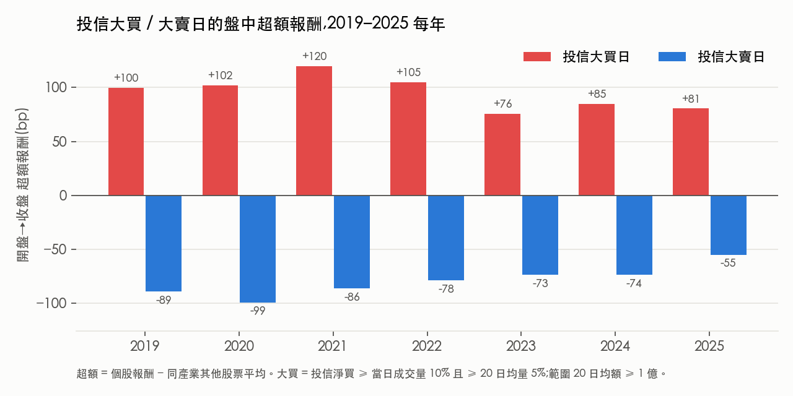
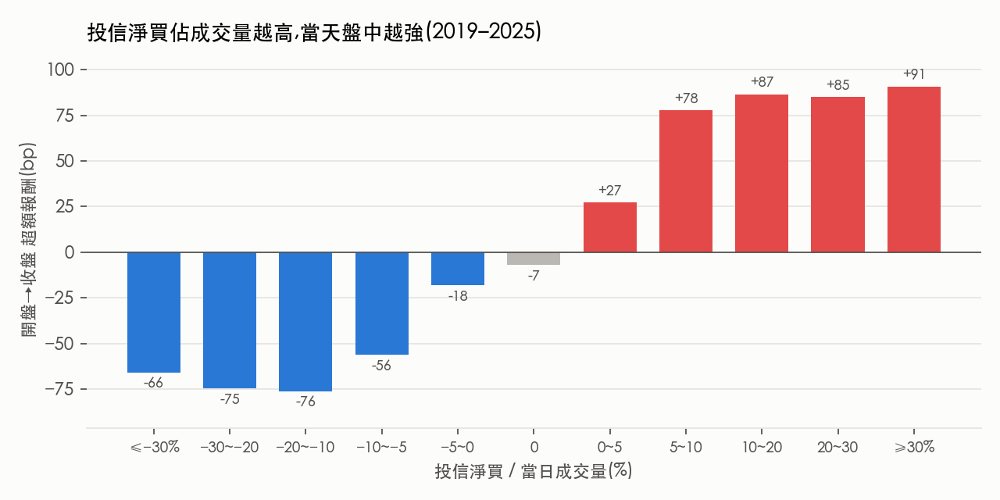
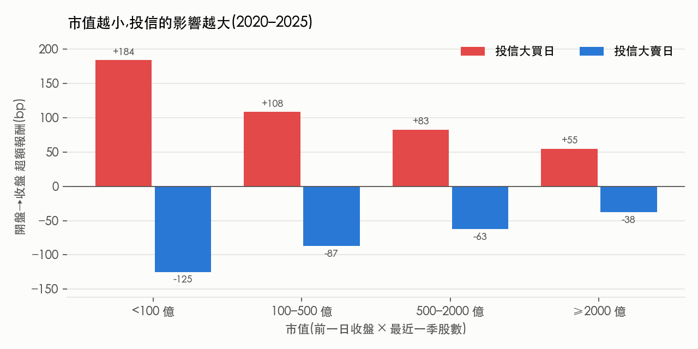

# 投信大動作對台股個股的影響：從事件交易的角度

> 我想做事件交易，也就是找出**事前可以預期、而且大到足以推動價格**的資金流。
> 國內投信（證券投資信託，也就是共同基金與 ETF 的發行商）是很自然的候選人：持股集中在中小型股，買賣常常一次就佔個股成交量一大塊。
> 投信每天的買賣超是公開資料，但收盤後才公布，看到之後才跟單通常已經晚了。所以這條路要走得通，必須先回答兩個問題：
>
> 1. **投信的大動作真的會推動股價嗎？推多少？**（如果沒有影響，就不值得預測）
> 2. **能不能在前一天就預測到投信會大買或大賣？**
>
> 這個 repo 是一個慢慢更新的 side project。目前完成第 1 題。

**資料**：2019-01 ～ 2025-12 上市櫃普通股（4 碼），投信 / 外資每日買賣超、日 K、產業分類、季度股數（FinMind，投信買賣超已對證交所與櫃買中心原始報表核對）
**工具**：Python / pandas / statsmodels
**狀態**：第一關（影響力）完成；第二關（投信進出場邏輯）進行中

| 投信大買日 盤中超額 | 投信大賣日 | 七年每一年 | 開盤跳空 | 市值 < 500 億 |
|---|---|---|---|---|
| **+90 bp**（中位 +66，勝率 67%，n = 28,491） | **−76 bp**（勝率 33%，n = 33,067） | 大買 +76 ～ +120 bp，大賣 −55 ～ −99 bp | 大買日 ≈ 0（−3 bp） | 大買 +108 ～ +184 bp |

---

## 1. 定義

| 項目 | 定義 |
|---|---|
| 範圍 | 4 碼普通股（上市 + 上櫃），20 日均成交金額 ≥ 1 億 |
| 投信大買 | 投信淨買 ≥ 當日成交量 10%，**且** ≥ 20 日均量 5% |
| 投信大賣 | 對稱：淨賣 ≥ 當日成交量 10% 且 ≥ 20 日均量 5% |
| 20 日均量 | 只用 T−1 以前的資料（不含當天） |
| 報酬 | 盤中 = 收盤 / 開盤 − 1；跳空 = 開盤 / 前收 − 1 |
| 超額 | 個股報酬 − 同產業其他股票（不含自己）的平均；沒有同業就減全市場平均 |
| 期間 | 2019–2025；2026 保留到最後才看 |

盤中報酬（開盤到收盤）不跨日，不受除權息影響。

## 2. 資料先驗證（`code/00_verify_*.py`）

投信買賣超用 FinMind，先抽樣比對官方原始報表：

- **上市**：對證交所 T86，2019 / 2023 / 2024 / 2025 / 2026 共 10 天，每一檔都一致（100%）。
- **上櫃**：對櫃買中心三大法人報表，4 天，100% 一致。
- **例外**：資料最後一天（2026-09-16）有 4.3% 的股票不一致。原因是當天晚上公布的是初版，之後才修正。實盤時晚上看到的就是初版，所以回測會有很輕微的前視偏差。樣本已排除這一天。

## 3. 結果（`code/03_impact.py`、`code/04_impact_by_size.py`）

### 3.1 大買日盤中明顯偏強，七年都成立

| | n | 跳空 | 盤中超額 | 盤中中位數 | 勝率 |
|---|---|---|---|---|---|
| 投信大買 | 28,491 | −3 bp | **+90 bp** | +66 bp | 67% |
| 投信大賣 | 33,067 | −19 bp | **−76 bp** | −65 bp | 33% |
| 其他 | 626,626 | +1 bp | 0 bp | −13 bp | 47% |

**開盤沒有跳空**：大買日的開盤跳空只有 −3 bp。這代表市場在開盤前並不知道投信當天會大買，價格是在盤中才被推上去的。大賣日開盤 −19 bp，看起來市場事前略有預期，但大部分的跌幅一樣發生在盤中。

### 3.2 買得越多，漲得越多（單調）

投信淨買佔當日成交量從 0～5% 到 5～10%，超額報酬從 +27 bp 跳到 +78 bp，超過 10% 之後大約持平在 +85 ～ +91 bp。賣方是對稱的。

### 3.3 迴歸：投信每單位流量的推力約是外資的 2 倍

盤中超額（bp）對 投信淨買 / 20 日均量、外資淨買 / 20 日均量，標準誤以「日期 × 個股」雙向群聚：

| 模型 | 投信係數 | t | 外資係數 | t | R² |
|---|---|---|---|---|---|
| 線性 | 683 | 36.5 | 337 | 34.5 | 0.104 |
| 平方根 sign·√\|f\| | 283 | 37.4 | 192 | 41.5 | 0.110 |

佔均量同樣比例的淨買，投信造成的價格變動大約是外資的 2 倍，分市值看每一組都是 1.8 到 2.3 倍。

### 3.4 市值越小，影響越大

| 市值 | 大買日盤中 | 大賣日盤中 | 大買事件數 | 投信 / 外資推力比 |
|---|---|---|---|---|
| < 100 億 | +184 bp | −125 bp | 794 | 1.81 |
| 100–500 億 | +108 bp | −87 bp | 9,658 | 1.91 |
| 500–2000 億 | +83 bp | −63 bp | 10,863 | 2.10 |
| ≥ 2000 億 | +55 bp | −38 bp | 5,536 | 2.29 |

（2020–2025。市值 = 前一日收盤 × 最近一季股數。）

權值股的外資參與率中位數高達 47%，投信的推力被稀釋。當沖成本約 25–35 bp，權值股的 +55 bp 扣完幾乎不剩，**權值股之外才是這個研究的範圍**。100–500 億這一組同時有大量事件和 +108 bp 的幅度，是最值得研究的區間。

## 4. 這代表什麼，還不代表什麼

**代表**：投信大買或大賣的那一天，個股盤中比同業強或弱 70 到 120 bp，七年穩定，而且量越大越明顯。這筆錢的規模夠付交易成本。

**還不代表**：

- **因果還沒證明。** 這是同一天的相關，有可能是投信去追當天本來就會漲的股票。開盤沒有跳空、以及量和報酬單調相關，都支持「是投信推的」，但不是證明。比較乾淨的檢驗，是用被動 ETF 依規則必須買的機械性流量（不是經理人的選擇），列在後續計畫。
- **還不能交易。** 收盤後才知道今天投信大買，這個 +90 bp 已經發生了。它是**天花板**：如果能 100% 事前猜中，扣掉 25–35 bp 成本，每筆淨賺約 55–65 bp。假設猜錯的日子平均報酬為 0，命中率要約 1/3 才打平。

所以接下來的問題是：**投信什麼時候會大買？能不能在前一天就看出來？**

## 5. 下一步

- [x] 第一關：影響力（2026-10-05）
- [ ] **第二關：投信的進出場邏輯**。把每天的買賣串成「一段部位」：從開始買、加碼、持有到賣出，看建倉期多長、進場前發生什麼（營收、突破、族群、時間點）、出場是否集中在估計成本的特定虧損或獲利幅度（停損 / 停利）、是否接近法定持股上限。
- [ ] 第三關：T−1 預測。用第二關找到的規則選出隔天可能大買的股票，跟「隔天跟昨天投信大買的股票」對照組比較。
- [ ] 拆出被動 ETF 的機械性流量（高股息 ETF 申購、換股），順便做因果檢驗。

## 重現

`code/` 依序執行：`00_verify_t86.py`、`00_verify_tpex.py` → `01_build_panel.py` → `03_impact.py` → `04_impact_by_size.py` → `make_figures.py`。
原始資料來自 FinMind（TaiwanStockInstitutionalInvestorsBuySell、TaiwanStockPrice、TaiwanStockInfo），存放路徑寫在各 script 開頭，資料本身不放進 repo。完整輸出在 `results/`。

## 更新紀錄

- **2026-10-06**：建立 repo，放上第 0 步（資料驗證）與第一關（影響力）。
