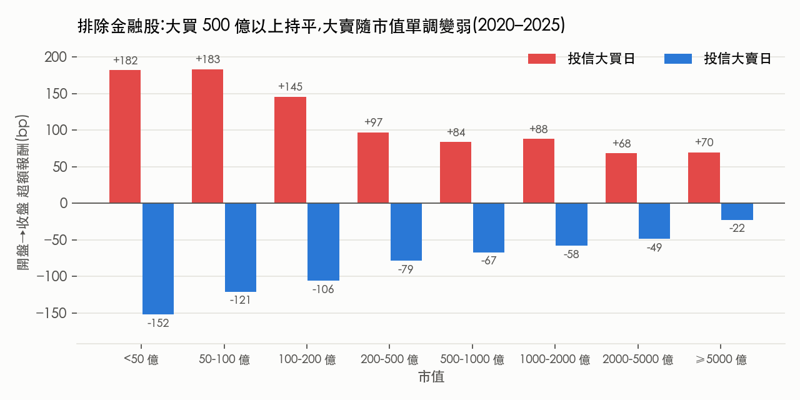

# 投信大動作對台股個股的影響：從事件交易的角度

> 我想做事件交易，也就是找出**事前可以預期、而且大到足以推動價格**的資金流。
> 國內投信（證券投資信託，也就是共同基金與 ETF 的發行商）是很自然的候選人：持股集中在中小型股，買賣常常一次就佔個股成交量一大塊。
> 投信每天的買賣超是公開資料，但收盤後才公布，看到之後才跟單通常已經晚了。所以這條路要走得通，必須先回答兩個問題：
>
> 1. **投信的大動作真的會推動股價嗎？推多少？**（如果沒有影響，就不值得預測）
> 2. **能不能在前一天就預測到投信會大買或大賣？**
>
> 這個 repo 是一個慢慢更新的 side project。目前第 1 題成立；第 2 題的答案是「投信會不會大買猜得到，但猜得到的那部分價格上沒有肉」，正在往盤中找。

**資料**：2019-01 ～ 2025-12 上市櫃普通股（4 碼），投信 / 外資每日買賣超、日 K、產業分類、季度股數、融資、月營收（FinMind / 公開資訊觀測站，投信買賣超已對證交所與櫃買中心原始報表核對）；2025-03 ～ 2026-02 逐筆成交與五檔；2024-01 ～ 02 七檔股票有下單身分標記的委託與成交
**工具**：Python / pandas / statsmodels
**範圍**：排除金融股，不設市值上限
**狀態**：第一關（影響力）成立；第二關（進出場）、第三關（前一天預測）、第四關（盤中偵測）已做第一輪，見第 5–8 節

| 投信大買日 盤中超額 | 投信大賣日 | 七年每一年 | 開盤跳空 | 排除金融後，市值 < 200 億 |
|---|---|---|---|---|
| **+90 bp**（中位 +66，勝率 67%，n = 28,491） | **−76 bp**（勝率 33%，n = 33,067） | 大買 +76 ～ +120 bp，大賣 −55 ～ −99 bp | 大買日 ≈ 0（−3 bp） | 大買 +145 ～ +183 bp |

---

## 1. 定義

| 項目 | 定義 |
|---|---|
| 範圍 | 4 碼普通股（上市 + 上櫃），20 日均成交金額 ≥ 1 億 |
| 投信大買 | 投信淨買 ≥ 當日成交量 10%，**且** ≥ 20 日均量 5% |
| 投信大賣 | 對稱：淨賣 ≥ 當日成交量 10% 且 ≥ 20 日均量 5% |
| 20 日均量 | 只用 T−1 以前的資料（不含當天） |
| 報酬 | 盤中 = 收盤 / 開盤 − 1；跳空 = 開盤 / 前收 − 1 |
| 超額 | 個股報酬 − 同產業其他股票（不含自己）的平均；沒有同業就減全市場平均 |
| 期間 | 2019–2025；2026 保留到最後才看 |

盤中報酬（開盤到收盤）不跨日，不受除權息影響。

## 2. 資料先驗證（`code/00_verify_*.py`）

投信買賣超用 FinMind，先抽樣比對官方原始報表：

- **上市**：對證交所 T86，2019 / 2023 / 2024 / 2025 / 2026 共 10 天，每一檔都一致（100%）。
- **上櫃**：對櫃買中心三大法人報表，4 天，100% 一致。
- **例外**：資料最後一天（2026-09-16）有 4.3% 的股票不一致。原因是當天晚上公布的是初版，之後才修正。實盤時晚上看到的就是初版，所以回測會有很輕微的前視偏差。樣本已排除這一天。

## 3. 結果（`code/03_impact.py`、`code/04_impact_by_size.py`）

### 3.1 大買日盤中明顯偏強，七年都成立

| | n | 跳空 | 盤中超額 | 盤中中位數 | 勝率 |
|---|---|---|---|---|---|
| 投信大買 | 28,491 | −3 bp | **+90 bp** | +66 bp | 67% |
| 投信大賣 | 33,067 | −19 bp | **−76 bp** | −65 bp | 33% |
| 其他 | 626,626 | +1 bp | 0 bp | −13 bp | 47% |

**開盤沒有跳空**：大買日的開盤跳空只有 −3 bp。這代表市場在開盤前並不知道投信當天會大買，價格是在盤中才被推上去的。大賣日開盤 −19 bp，看起來市場事前略有預期，但大部分的跌幅一樣發生在盤中。

### 3.2 買得越多，漲得越多（單調）

投信淨買佔當日成交量從 0～5% 到 5～10%，超額報酬從 +27 bp 跳到 +78 bp，超過 10% 之後大約持平在 +85 ～ +91 bp。賣方是對稱的。

### 3.3 迴歸：投信每單位流量的推力約是外資的 2 倍

盤中超額（bp）對 投信淨買 / 20 日均量、外資淨買 / 20 日均量，標準誤以「日期 × 個股」雙向群聚：

| 模型 | 投信係數 | t | 外資係數 | t | R² |
|---|---|---|---|---|---|
| 線性 | 683 | 36.5 | 337 | 34.5 | 0.104 |
| 平方根 sign·√\|f\| | 283 | 37.4 | 192 | 41.5 | 0.110 |

佔均量同樣比例的淨買，投信造成的價格變動大約是外資的 2 倍，分市值看每一組都是 1.8 到 2.3 倍。

### 3.4 市值越小，影響越大

| 市值 | 大買日盤中 | 大賣日盤中 | 大買事件數 | 投信 / 外資推力比 |
|---|---|---|---|---|
| < 100 億 | +184 bp | −125 bp | 794 | 1.81 |
| 100–500 億 | +108 bp | −87 bp | 9,658 | 1.91 |
| 500–2000 億 | +83 bp | −63 bp | 10,863 | 2.10 |
| ≥ 2000 億 | +55 bp | −38 bp | 5,536 | 2.29 |

（2020–2025。市值 = 前一日收盤 × 最近一季股數。）

權值股的外資參與率中位數高達 47%，投信的推力被稀釋。當沖成本約 25–35 bp，≥ 2000 億的 +55 bp 扣完幾乎不剩。但這個平均其實混了兩種股票，見下一節。

### 3.5 範圍修正：問題在金融股，不在市值（`code/05`–`07`）

國巨市值超過 2000 億，投信大買日卻有 +97 bp（勝率 82%）。拆開來看，≥ 2000 億的 +55 bp 是被金融股拉低的：

| 大買日盤中（2020–2025） | < 500 億 | 500–2000 億 | ≥ 2000 億 |
|---|---|---|---|
| 電子 / 其他 | +116 bp | +89 bp | **+78 bp** |
| 傳產 / 電信 | +105 bp | +60 bp | +43 bp |
| 金融 | +49 bp | +31 bp | **+24 bp** |

金融股波動小，同樣的買盤換算成 bp 本來就小。改用個股自己的盤中波動（前 20 日標準差）當單位，金融股的劣勢縮小一半，剩下的部分跟傳產差不多；電子股在各市值都最敏感。但交易看的是 bp，大型金融股 +24 bp 低於成本，所以**範圍改成：排除金融股，不設市值上限**。

排除金融後把市值切細：

- **大買**：200 億以下最強（+145 ～ +183 bp），500 億以上變成平台（+68 ～ +88 bp），不再隨市值下降。電子股在 500 億以上都維持 +78 ～ +94 bp。
- **大賣**：完全隨市值單調變弱，≥ 5000 億只剩 −22 bp。大型股的買賣影響不對稱。
- 每個市值組的大買，2020–2025 六年都是正的。
- 小型股的交易成本（買賣價差）可能高於 25–35 bp，這裡還沒扣。

## 4. 這代表什麼，還不代表什麼

**代表**：投信大買或大賣的那一天，個股盤中比同業強或弱 70 到 120 bp，七年穩定，而且量越大越明顯。這筆錢的規模夠付交易成本。

**還不代表**：

- **因果還沒證明。** 這是同一天的相關，有可能是投信去追當天本來就會漲的股票。開盤沒有跳空、以及量和報酬單調相關，都支持「是投信推的」，但不是證明。比較乾淨的檢驗，是用被動 ETF 依規則必須買的機械性流量（不是經理人的選擇），列在後續計畫。
- **還不能交易。** 收盤後才知道今天投信大買，這個 +90 bp 已經發生了。它是**天花板**：如果能 100% 事前猜中，扣掉 25–35 bp 成本，每筆淨賺約 55–65 bp。假設猜錯的日子平均報酬為 0，命中率要約 1/3 才打平。

所以接下來的問題是：**投信什麼時候會大買？能不能在前一天就看出來？**

## 5. 外資是投信的對手方（`code/08`、`code/12`、`code/13`）

### 5.1 外資對做時，衝擊只剩 1/3

| 大買日盤中超額（非金融，2020–2025） | 外資反向（淨賣 ≥ 當日量 5%） | 外資 ±5% 內 | 外資同向 | 外資反向的比例 |
|---|---|---|---|---|
| < 200 億 | +69 bp | +197 | +222 | 38% |
| 200–500 億 | +47 | +147 | +171 | 56% |
| 500–2000 億 | +52 | +143 | +144 | 63% |
| ≥ 2000 億 | +43 | +106 | +112 | 62% |

市值越大，外資越常站在對面，這是大型股平均衝擊較小的主因之一。大型股的大賣日如果外資在買，跌幅只剩 −7 bp。

### 5.2 外資沒有提前卡位，而是持續站在對面

投信大買日前後 ±5 天，淨額佔當日量平均：投信 +4.6% → +11.0%（第 −1 天）→ **+20.5%（第 0 天）** → +11.3% → +4.8%；外資 −2.5% → −6.2% → **−9.9%** → −8.9% → −2.9%（基準 −0.7%）。外資在第 0 天以前沒有先買，所以不是卡位；第 0 天反向的外資，前三天就已經在賣（−7.7% / −9.8% / −11.6%），是外資自己的多日賣出。

### 5.3 延續性：投信極強，外資幾乎沒有

| 同定義（淨買 ≥ 當日量 10% 且 ≥ 均量 5%） | 今天大買 → 明天又大買 | 基準 | 倍數 | 淨額自相關 |
|---|---|---|---|---|
| 投信 | 42.7% | 4.0% | 10.8× | 0.36 |
| 外資 | 34.2% | 23.0% | 1.5× | 0.03 |

前一天投信買 ≥ 10% 量時，若外資同時賣 ≥ 20% 量，隔天投信續大買 54.5%（外資沒動時 33%）。外資賣出看起來提供了投信需要的流動性。

## 6. 第二關：出場有沒有停損痕跡（`code/09`–`code/11`）

把投信的買賣串成部位：沉寂 20 天後淨買 ≥ 均量 5% 開始，成本 = 淨買日均價加權（賣出不改成本），賣到剩高峰 20% 以下或 60 天沒動作結束。2019–2025 共 901 段部位、515 檔，持有中位 57 天。

| 前一天收盤距部位成本 | 第一次跌到這麼深：隔天賣 ≥ 10% 部位 | 之前就跌過 |
|---|---|---|
| −5 ～ 0% | 2.9% | 2.4% |
| −10 ～ −5% | 5.5% | 2.6% |
| −15 ～ −10% | **8.1%** | 2.2% |
| −30 ～ −25% | 8.5% | 2.3% |

（只看前一天投信沒在賣的日子，避免把「連續賣」誤認成停損。）前一天只小跌 0–2% 時，第一次跌破 −10% 仍有 6.5%，獲利中只有 1.8%，所以觸發的是「相對成本的深度」，不只是對壞消息反應。門檻是漸進的（約 −5% 到 −10%），符合多家投信門檻不同、加總後被抹平。

**但價格上沒反應**：第一次跌破 −10% 的隔天（1,479 次），開盤 −5 bp、盤中 −0.4 bp。只有 7% 真的賣（那 107 天盤中 −93 bp），其餘稀釋到 0。停損規則存在，單獨不能交易。

## 7. 第三關：前一天能不能預測（`code/14`–`code/19`）

### 7.1 單因子（隔天投信大買機率相對基準，2019–2023 / 2024–2025 都成立才列）

| 因子（前一天收盤已知） | 倍數 |
|---|---|
| 投信近 20 天買超過 10 天 | 6.6× / 5.7× |
| 投信超過 60 天沒動 | 0.01× / 0.01×（幾乎不會突然大買） |
| 外資 5 天累計賣超 ≥ 1 倍均量 | 2.4× / 3.6× |
| 同產業今天 5–10% 被投信大買 | 2.8× / 1.8× |
| 距 60 日高 5% 內 | 1.5× / 1.6× |
| 20 天漲 0–10% / > 40% | 1.4× / 0.25× |
| 融資 5 天減 ≥ 10% | 1.3× / 1.65× |
| 月營收年增 > 100% | 0.3×（投信不追營收爆發股） |

### 7.2 命中率拉得上去，報酬沒有

| 逐步疊加條件 | 命中率 | 隔天跳空 | 隔天盤中超額 |
|---|---|---|---|
| 投信近 20 天買 > 5 天 | 13% / 20% | −3 / −9 bp | +5 / +9 bp |
| + 外資 5 天賣 ≥ 0.5 倍均量 | 21% / 33% | −17 / −20 | +14 / +9 |
| + 20 天漲 0–20%、沒漲停、距高 ≤ 10% | 28% / 43% | −24 / −31 | **+10 / +10** |
| + 同產業 ≥ 5% 被大買 | 50% / 58% | −32 / −33 | +13 / −2 |

當沖成本 25–35 bp，+10 bp 不夠。就算只看猜中的日子，隔天盤中也只有 +21 bp：猜得到的大買，七成隔天外資繼續對做（−18 bp），外資同向的兩成才有 +65 bp。改成外資沒在賣，命中率掉到 13–20%，報酬仍 ≤ +12 bp。

**結論：用日資料在前一天預測，猜得到的那部分大買，價格上已經沒有肉；+90 bp 集中在猜不到的意外。** 但這些因子可以當**盤前觀察名單**：近 20 天投信買 > 5 天，每天約 176 檔，涵蓋隔天 73% 的大買。

## 8. 第四關：盤中能不能認出投信（`code/20`–`code/22`）

### 8.1 投信怎麼下單（有身分標記的資料，7 檔 × 2024-01 ～ 02，重押日 50 天）

- **時段後重**：當天方向的成交到 10:00 只完成 20%、到 11:00 42%，12:00–13:25 佔 30%；全市場到 10:00 已完成 40%。
- **主動吃單 72%**（外資 61%、散戶 40%），但幾乎都是限價 ROD 單。
- **小單拆單**：每天中位 302 筆委託，每筆 1–5 張（2 張最多），間隔中位 4 秒。

樣本極小，只當候選特徵。

### 8.2 就算完美預知，價格也是前段反應

名單內、事後已知當天投信大買，從各時間點到收盤還剩的超額（2025 上半 / 下半）：9:10 +54 / +90 bp，**9:30 +46 / +64**，10:00 +28 / +33。沒大買的日子 9:30 之後 −8 ～ −12 bp。投信到 10 點才做 2 成，價格卻在 10 點前就走了一大半，表示市場其他人提早反應。9:30 進場、成本 30 bp，命中率要超過約 6 成。

### 8.3 簡單的逐筆特徵做不到

在 9:30，「1–5 張小單偏外盤的分鐘比例 ≥ 70%」只把大買率從 20% / 11% 拉到 30% / 20%；而且被選出來的股票之後平均 **−15 bp**，早上偏賣的反而 +10 ～ +13 bp。這是一般的盤中反轉：小單大多是散戶，投信的節奏被淹沒了。

## 9. 目前結論與下一步

1. 投信大動作的影響是真的，七年穩定，排除金融股後不限市值都有。
2. 但前一天猜得到的、盤中簡單特徵認得出的，價格上都沒有肉。
3. 還沒試的方向：
   - [ ] 用身分標記資料學更精確的投信簽名（固定間隔、固定張數、委託生命週期），再回到大樣本驗證
   - [ ] 盤中反轉本身（早上偏賣的股票後面 +10 ～ +13 bp）是否獨立於投信成立
   - [ ] 分點：投信透過哪些券商下單（盤後資料），能否補強隔天預測
   - [ ] 拆出被動 ETF 的機械性流量，順便做因果檢驗

## 重現

`code/` 依序執行：`00_verify_t86.py`、`00_verify_tpex.py` → `01_build_panel.py` → `03_impact.py` → `04` ～ `07`（範圍與市值）→ `08`、`12`、`13`（外資）→ `09` ～ `11`（部位與停損）→ `14`、`15`（下載月營收）、`16` ～ `19`（前一天預測）→ `20` ～ `22`（盤中）→ `make_figures.py`。
原始資料來自 FinMind（TaiwanStockInstitutionalInvestorsBuySell、TaiwanStockPrice、TaiwanStockInfo、TaiwanStockMarginPurchaseShortSale）與公開資訊觀測站每月營收彙總；逐筆與身分標記資料是私有資料，不公開。存放路徑寫在各 script 開頭，資料本身不放進 repo。完整輸出在 `results/`。

## 更新紀錄

- **2026-10-06**：建立 repo，放上第 0 步（資料驗證）與第一關（影響力）。
- **2026-10-06**：範圍修正：排除金融股、不設市值上限（國巨等大型電子股仍受投信影響）；加入波動標準化與市值細分。
- **2026-10-06**：外資對手方、停損痕跡、前一天預測、盤中偵測第一輪（第 5–8 節）。主要是負面結果：猜得到的部分沒有肉。
